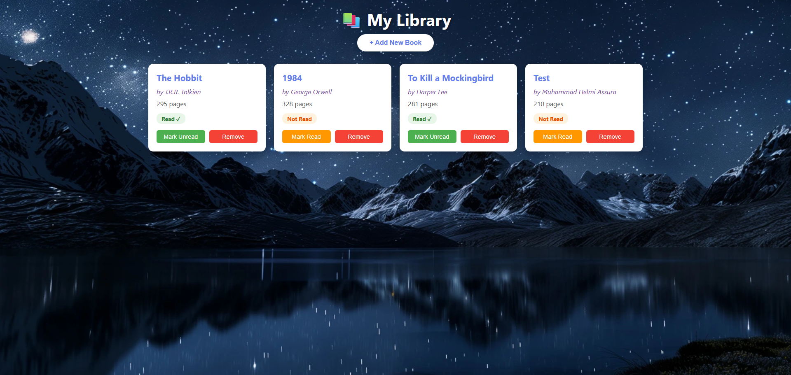
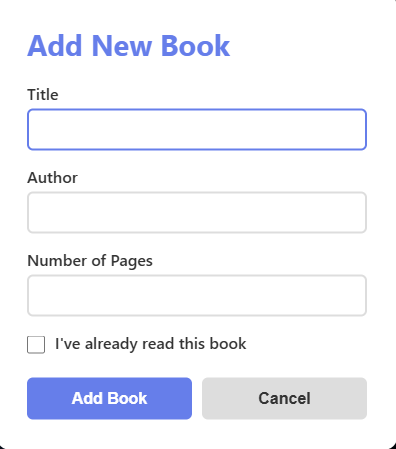

# 📚 Library Management App

A simple and elegant web application to manage your personal book library. Built with vanilla JavaScript, HTML, and CSS.


## ✨ Features

- ➕ **Add New Books** - Add books with title, author, pages, and read status
- 📖 **Track Reading Status** - Mark books as read or unread
- 🗑️ **Remove Books** - Delete books from your library
- 💾 **Dynamic Storage** - All books stored in JavaScript array
- 🎨 **Beautiful UI** - Modern gradient design with smooth animations
- 📱 **Responsive Design** - Works on desktop, tablet, and mobile devices
- 🔒 **Unique IDs** - Each book has a unique identifier using `crypto.randomUUID()`

## 🚀 Demo

### Main Library View


### Add Book Dialog


### Book Cards


## 🛠️ Technologies Used

| Technology | Purpose |
|------------|---------|
| **HTML5** | Structure and semantic markup |
| **CSS3** | Styling, animations, and responsive design |
| **JavaScript (ES6+)** | Logic, DOM manipulation, and data management |
| **Dialog API** | Native modal for adding books |
| **Crypto API** | Generating unique book IDs |

## 📋 Prerequisites

- A modern web browser (Chrome, Firefox, Safari, Edge)
- No additional dependencies or installations required!

## 🎯 Getting Started

1. **Clone the repository**
   ```bash
   git clone https://github.com/helmiassura/library.git
   cd library
   ```

2. **Open the application**
   - Simply open `index.html` in your web browser
   - Or use a local server:
     ```bash
     # Using Python
     python -m http.server 8000
     
     # Using Node.js (http-server)
     npx http-server
     ```

3. **Start managing your library!**

## 📁 Project Structure

```
LIBRARY/
│
├── assets/
│   ├── css/
│   │   └── style.css       # Main stylesheet
│   ├── img/
│   │   └── bg-profile-dark.webp  # Background image
│   └── js/
│       └── script.js       # Main JavaScript file
│
├── index.html              # Main HTML file
└── README.md               # Project documentation
```

## 💻 Code Structure

### JavaScript Components

#### 1. **Book Constructor**
```javascript
function Book(title, author, pages, read) {
  this.id = crypto.randomUUID();
  this.title = title;
  this.author = author;
  this.pages = pages;
  this.read = read;
}
```

#### 2. **Book Prototype Method**
```javascript
Book.prototype.toggleRead = function() {
  this.read = !this.read;
};
```

#### 3. **Core Functions**
- `addBookToLibrary()` - Adds a new book to the library array
- `displayBooks()` - Renders all books to the DOM
- `toggleReadStatus()` - Toggles book read status
- `removeBook()` - Removes book from library

### CSS Highlights

- **Gradient Background**: Beautiful purple gradient using linear-gradient
- **Grid Layout**: Responsive card layout with CSS Grid
- **Smooth Animations**: Hover effects and transitions
- **Modal Centering**: Dialog positioned perfectly at viewport center

## 🎮 Usage

### Adding a Book

1. Click the **"+ Add New Book"** button
2. Fill in the book details:
   - Title (required)
   - Author (required)
   - Number of Pages (required)
   - Read status (checkbox)
3. Click **"Add Book"** to save or **"Cancel"** to close

### Managing Books

- **Toggle Read Status**: Click the **"Mark Read"** or **"Mark Unread"** button on any book card
- **Remove Book**: Click the **"Remove"** button to delete a book from your library

## 🎨 Design Features

### Typography
- Font Family: 'Segoe UI', Tahoma, Geneva, Verdana, sans-serif
- Responsive font sizes
- Clear hierarchy with varied weights

## 🔧 Key Implementation Details

### Unique Book IDs
Each book is assigned a unique ID using the Web Crypto API:
```javascript
this.id = crypto.randomUUID();
```

### Data Attributes
Books are linked to DOM elements using data attributes:
```javascript
bookCard.setAttribute('data-book-id', book.id);
```

### Event Prevention
Form submission is handled without page reload:
```javascript
bookForm.addEventListener('submit', (e) => {
  e.preventDefault();
  // Handle form data
});
```

## ⚠️ Limitations

- **No Persistent Storage**: Data is lost on page reload (as per assignment requirements)
- **Client-Side Only**: No backend or database integration
- **Browser Dependent**: Requires modern browser with ES6+ support


## 📝 License

This project is licensed under the MIT License - see the LICENSE file for details.

## 👤 Author

**Muhammad Helmi Assura**

## 🙏 Acknowledgments

- The Odin Project for the assignment inspiration
- MDN Web Docs for excellent documentation
- Font Awesome for icons (if used)
